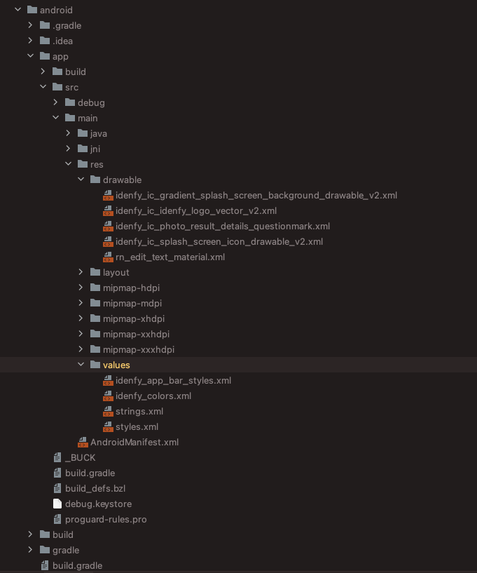
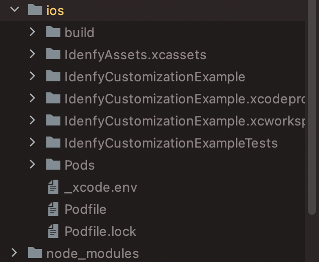
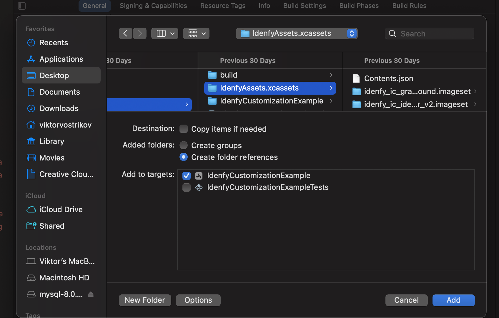
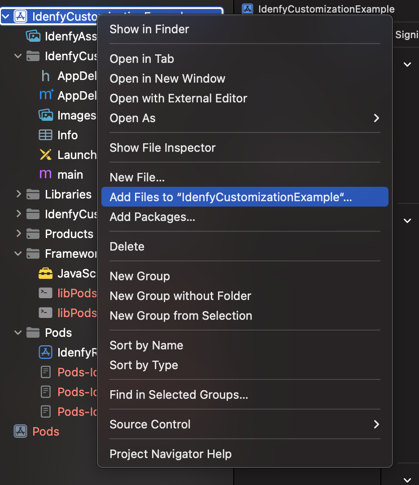

## This is an official React Native plugin, which provides an easier integration of iDenfy KYC services. This plugin offers [identity verification](#identity-verification-flow-usage) and [face authentication](#face-authentication-flow-usage) flows

## Table of contents

- [Getting started](#getting-started)
  - [1. Obtaining an authentication token](#1-obtaining-an-authentication-token)
  - [2. Adding Idenfy React Native SDK](#2-adding-idenfy-react-native-sdk)
    - [2.1 Availability information & new project setup](#21-availability-information--new-project-setup)
    - [2.2 Adding SDK dependency through npm](#22-adding-sdk-dependency-through-npm)
    - [2.3 Configure Android project](#23-configure-android-project)
    - [2.4 Configure IOS project](#24-configure-ios-project)

* [Usage](#usage)
  - [Identity verification usage](#identity-verification-flow-usage)
  - [Face authentication usage](#face-authentication-flow-usage)
* [Callbacks](#callbacks)
  - [Identity verification callbacks](#identity-verification-flow-callbacks)
  - [Face authentication callbakcs](#face-authentication-flow-callbacks)
* [Additional customization](#additional-customization)
* [SDK Integration tutorials](#sdk-integration-tutorials)

## Getting started

### 1. Obtaining an authentication token

The SDK requires token for starting initialization. [Token generation guide](https://documentation.idenfy.com/API/GeneratingIdentificationToken)

### 2. Adding Idenfy React Native SDK

#### 2.1 Availability information & new project setup

Minimum required versions by the platform:

**React Native - 0.73.9**

**IOS - 13.4**

**iOS SDK is built using xCode 16.2**

**Android - API 24**

If you are starting a new React Native project you can follow [environment setup guide](https://reactnative.dev/docs/environment-setup).
Once the setup completed successfully, you can initialize a new project with CLI:

```shell
$ npx react-native init AwesomeProject
```

[Here is the full example project](IdenfyNewProjectExample.zip), which integrates our SDK and is generated via CLI command:

```shell
$  npx react-native init IdenfyNewProjectExample --template react-native-template-typescript
```

#### 2.2 Adding SDK dependency through npm

Navigate to the root directory of your React Native project. The rest of this second section will assume you are in the root directory.
Run the following command:

```shell
$ npm install @idenfy/react-native-sdk --save
```

#### 2.3 Configure Android project

##### Manually update build files without the script

Add the maven link `android/build.gradle`:

```gradle
allprojects {
  repositories {
    maven { url 'https://jitpack.io' }
    maven { url 'https://developer.huawei.com/repo/' }
  }
}
```

Enable multidex in `android/app/build.gradle`:

```gradle
android {
  defaultConfig {
     multiDexEnabled true
  }
}
```

##### Proguard rules

If you use code obfuscation for Android with a proguard-rules.pro file. You should update it with [ours](https://github.com/idenfy/iDenfyResources/blob/main/sdk/android/Proguard/proguard-rules.pro), otherwise some unexpected behaviour might occur.

Also, since AGP 8.0 enables R8 full mode by default, make sure you have disabled R8 full mode in the **gradle.properties** file:

```gradle
android.enableR8.fullMode=false
```

#### 2.4 Configure IOS project

`NSCameraUsageDescription' must be provided in the application's 'Info.plist' file:

```xml
<key>NSCameraUsageDescription</key>
<string>Required for document and facial capture</string>
```

Add the following lines to the Podfile of your project:

```ruby
post_install do |installer|
                      installer.pods_project.targets.each do |target|
                        target.build_configurations.each do |config|
                          config.build_settings['ENABLE_BITCODE'] = 'NO'
                        end

                        if target.name == "lottie-ios"
                          target.build_configurations.each do |config|
                            config.build_settings['ENABLE_BITCODE'] = 'NO'
                            config.build_settings['ONLY_ACTIVE_ARCH'] = 'NO'
                            config.build_settings['BUILD_LIBRARY_FOR_DISTRIBUTION'] = 'YES'
                            config.build_settings["IPHONEOS_DEPLOYMENT_TARGET"] = '13.0'
                          end
                        end
                      end
                      # https://github.com/facebook/react-native/blob/main/packages/react-native/scripts/react_native_pods.rb#L197-L202
                      react_native_post_install(
                                                installer,
                                                config[:reactNativePath],
                                                :mac_catalyst_enabled => false
                                                )
                                                __apply_Xcode_12_5_M1_post_install_workaround(installer)
                    end
```

The Podfile **should look like** the one in the /example/ios/Podfile

The main idea is to have **use_native_modules!**, **static linkage** and flipper **disabled** in the target Pod settings.

Take a look at a fresh projects' Podfile:

````ruby
# Resolve react_native_pods.rb with node to allow for hoisting
require Pod::Executable.execute_command('node', ['-p',
  'require.resolve(
    "react-native/scripts/react_native_pods.rb",
    {paths: [process.argv[1]]},
  )', __dir__]).strip
platform :ios, '13.4'
prepare_react_native_project!
# If you are using a `react-native-flipper` your iOS build will fail when `NO_FLIPPER=1` is set.
# because `react-native-flipper` depends on (FlipperKit,...) that will be excluded
#
# To fix this you can also exclude `react-native-flipper` using a `react-native.config.js`
# ```js
# module.exports = {
#   dependencies: {
#     ...(process.env.NO_FLIPPER ? { 'react-native-flipper': { platforms: { ios: null } } } : {}),
# ```
flipper_config = ENV['NO_FLIPPER'] == "1" ? FlipperConfiguration.disabled : FlipperConfiguration.enabled
linkage = ENV['USE_FRAMEWORKS']
if linkage != nil
  Pod::UI.puts "Configuring Pod with #{linkage}ally linked Frameworks".green
  use_frameworks! :linkage => linkage.to_sym
end

target 'IdenfyReactNativeExample' do
  use_frameworks! :linkage => :static
  config = use_native_modules!

  use_react_native!(
                    :path => config[:reactNativePath],
                    # Enables Flipper.
                    #
                    # Note that if you have use_frameworks! enabled, Flipper will not work and
                    # you should disable the next line.
                    #     :flipper_configuration => flipper_config,
                    # An absolute path to your application root.
                    :app_path => "#{Pod::Config.instance.installation_root}/.."
                    )

                    target 'IdenfyReactNativeExampleTests' do
                      inherit! :complete
                      # Pods for testing
                    end

                    post_install do |installer|
                      installer.pods_project.targets.each do |target|
                        target.build_configurations.each do |config|
                          config.build_settings['ENABLE_BITCODE'] = 'NO'
                        end

                        if target.name == "lottie-ios"
                          target.build_configurations.each do |config|
                            config.build_settings['ENABLE_BITCODE'] = 'NO'
                            config.build_settings['ONLY_ACTIVE_ARCH'] = 'NO'
                            config.build_settings['BUILD_LIBRARY_FOR_DISTRIBUTION'] = 'YES'
                            config.build_settings["IPHONEOS_DEPLOYMENT_TARGET"] = '13.0'
                          end
                        end
                      end
                      # https://github.com/facebook/react-native/blob/main/packages/react-native/scripts/react_native_pods.rb#L197-L202
                      react_native_post_install(
                                                installer,
                                                config[:reactNativePath],
                                                :mac_catalyst_enabled => false
                                                )
                    end
end
````

Install the pods (run **pod update** as well):

```bash
cd ios
pod install
pod update
cd ..
```

## Usage

#### Identity verification flow usage

After successful integration you should be able to call IdenfyReactNative.start method.

If project is not successfully compiled or runtime issues occurs, make sure you have followed the steps. For better understanding you may check at the sample app in this repository.

Once you have an authentication token, which can be retried with following code, found in the example app, you can call start method (**you need to import it**):

```typescript jsx
import { start, startFaceReAuth } from '@idenfy/react-native-sdk';
getAuthToken = () => {
  let encodedAuth = new Buffer(apiKey + ':' + apiSecret).toString('base64');
  return fetch(BASE_URL + 'api/v2/token', {
    method: 'POST',
    headers: {
      'Accept': 'application/json',
      'Content-Type': 'application/json',
      'Authorization': 'Basic ' + encodedAuth,
    },
    body: JSON.stringify({
      clientId: clientId,
    }),
  })
    .then((response) => {
      if (response.ok) {
        response.json().then((json) => this.startSDK(json.authToken));
      } else {
        response.json().then((json) => {
          console.log(json);
          this.setState({
            message:
              'Error getting authToken, status code is: ' +
              response.status.toString() +
              '\n \n Response: ' +
              JSON.stringify(json),
            sdkFlowComplete: true,
          });
        });
      }
    })
    .catch((error) => {
      this.setState({
        message: error.message,
        sdkFlowComplete: true,
      });
      console.error(error);
    });
};
```

Calling IdenfyReactNative.start with provided authToken:

```typescript jsx
import { start, startFaceReAuth } from '@idenfy/react-native-sdk';
startSDK = (authToken: String) => {
  const idenfyUISettings = new IdenfyUIBuilder()
    .withAdditionalSupportView(true)
    .withIdenfyDocumentSelectionType(
      IdenfyDocumentSelectionType.navigateOnContinueButton
    )
    .withOnBoardingViewType(IdenfyOnBoardingViewType.multipleStatic)
    .withInstructions(IdenfyInstructionsEnum.dialog)
    .withImmediateRedirect(ImmediateRedirectEnum.full)
    .withLanguageSelection(true)
    .withIdenfyIdentificationResultsUISettingsV2(
      new IdenfyIdentificationResultsUISettingsV2(true, true, true)
    )
    .withDocumentCameraFrameVisibility(
      new HiddenForSpecificCountriesAndDocumentTypes({
        US: [DocumentTypeEnum.PASSPORT],
      })
    )
    .withSkipInternalPrivacyPolicy(false)
    .build();

  const idenfySettings = new IdenfyBuilder()
    .withSelectedLocale(IdenfyLocaleEnum.EN)
    .withUISettings(idenfyUISettings)
    .withSSLPinning(true)
    .build();

  // Start with Idenfy Settings
  start({
    authToken: authToken,
    idenfySettings: idenfySettings.toJson(),
  })
    // Start without Idenfy Settings
    // start({
    //   authToken: authToken,
    // })
    .then((response) => {
      this.setState({
        message: JSON.stringify(response),
        sdkFlowComplete: true,
      });
    })
    .catch((error) => {
      this.setState({
        message: error.code + ': ' + error.message,
        sdkFlowComplete: true,
      });
    });
};
```

## Face Authentication flow usage

To use the newest face authentication feature you need to have a **scanRef**. On how to obtain it as well as general information are available in our documentation.

### 1. Checking face authentication status

Firstly, you should check for the authentication status, whether the face authentication can be performed. Having checked that, you will receive a token status:

| Name             | Description                             |
| ---------------- | --------------------------------------- |
| `AUTHENTICATION` | The user can authenticate by face       |
| `IDENTIFICATION` | The user must perform an identification |

```typescript jsx
getFaceAuthTokenType = () => {
  let encodedAuth = new Buffer(apiKey + ':' + apiSecret).toString('base64');
  return fetch(
    BASE_URL +
      'identification/facial-auth/' +
      scanRef +
      '/check-status/?method=' +
      authenticationMethod,
    {
      method: 'GET',
      headers: {
        'Accept': 'application/json',
        'Content-Type': 'application/json',
        'Authorization': 'Basic ' + encodedAuth,
      },
    }
  )
    .then((response) => {
      console.log(response);
      if (response.ok) {
        response.json().then((json) => {
          switch (json.type) {
            case 'AUTHENTICATION':
              //The user can authenticate by face
              this.getAuthTokenForFaceAuth(json.type);
              break;
            default:
              //The user must perform an identification
              break;
          }
        });
      } else {
        response.json().then((json) => {
          console.log(json);
          this.setState({
            message:
              'Error getting authToken, status code is: ' +
              response.status.toString() +
              '\n \n Response: ' +
              JSON.stringify(json),
            sdkFlowComplete: true,
          });
        });
      }
    })
    .catch((error) => {
      this.setState({
        message: error.message,
        sdkFlowComplete: true,
      });
      console.error(error);
    });
};
```

### 2. Obtaining token

Next step is to obtain the authentication token. Please use this util method

```typescript jsx
getAuthTokenForFaceAuth = (type: String) => {
  let encodedAuth = new Buffer(apiKey + ':' + apiSecret).toString('base64');
  return fetch(BASE_URL + 'partner/authentication-info', {
    method: 'POST',
    headers: {
      'Accept': 'application/json',
      'Content-Type': 'application/json',
      'Authorization': 'Basic ' + encodedAuth,
    },
    body: JSON.stringify({
      scanRef: scanRef,
      type: type,
      method: authenticationMethod,
    }),
  })
    .then((response) => {
      console.log(response);
      if (response.ok) {
        response.json().then((json) => this.startFaceAuthSDK(json.token));
      } else {
        response.json().then((json) => {
          console.log(json);
          this.setState({
            message:
              'Error getting authToken, status code is: ' +
              response.status.toString() +
              '\n \n Response: ' +
              JSON.stringify(json),
            sdkFlowComplete: true,
          });
        });
      }
    })
    .catch((error) => {
      this.setState({
        message: error.message,
        sdkFlowComplete: true,
      });
      console.error(error);
    });
};
```

### 3. Initializing the SDK

```typescript jsx
import { start, startFaceReAuth } from '@idenfy/react-native-sdk';
startFaceAuthSDK = (authToken: String) => {
  startFaceReAuth({
    authToken: authToken,
  })
    .then((response) => {
      this.setState({
        message: JSON.stringify(response),
        sdkFlowComplete: true,
      });
    })
    .catch((error) => {
      this.setState({
        message: error.code + ': ' + error.message,
        sdkFlowComplete: true,
      });
    });
};
```

An additional bool can be passed to the function to set the immediate redirect feature.
This sets whether the results from iDenfy SDK should be received immediately without any additional result pages

```typescript jsx
startFaceReAuth({
  authToken: authToken,
  withImmediateRedirect: false,
});
```

Face authentication UI settings class can be passed to modify the face authentication flow:

```typescript jsx
let idenfyFaceAuthUISettings = new IdenfyFaceAuthUIBuilder()
  .withLanguageSelection(true)
  .withOnBoardingView(true)
  .build();

startFaceReAuth({
  authToken: authToken,
  withImmediateRedirect: false,
  idenfyFaceAuthUISettings: idenfyFaceAuthUISettings,
});
```

## Callbacks

#### Identity verification flow callbacks

Callback from the SDK can be retrieved from start promise:

```typescript jsx
import { start, startFaceReAuth } from '@idenfy/react-native-sdk';
start({
  authToken: authToken,
}).then((response) => {
  this.setState({
    message: JSON.stringify(response),
    sdkFlowComplete: true,
  });
});
```

Result will have a following JSON structure:

```javascript
{
  "autoIdentificationStatus": "APPROVED",
    "manualIdentificationStatus": "APPROVED"
}
```

Information about the IdenfyIdentificationResult **autoIdentificationStatus** statuses:

| Name         | Description                                                                                                                       |
| ------------ | --------------------------------------------------------------------------------------------------------------------------------- |
| `APPROVED`   | The user completed an identification flow and the identification status, provided by an automated platform, is APPROVED.          |
| `FAILED`     | The user completed an identification flow and the identification status, provided by an automated platform, is FAILED.            |
| `UNVERIFIED` | The user did not complete an identification flow and the identification status, provided by an automated platform, is UNVERIFIED. |

Information about the IdenfyIdentificationResult **manualIdentificationStatus** statuses:

| Name       | Description                                                                                                                                                                                                                                             |
| ---------- | ------------------------------------------------------------------------------------------------------------------------------------------------------------------------------------------------------------------------------------------------------- |
| `APPROVED` | The user completed an identification flow and was verified manually while waiting for the manual verification results in the iDenfy SDK. The identification status, provided by a manual review, is APPROVED.                                           |
| `FAILED`   | The user completed an identification flow and was verified manually while waiting for the manual verification results in the iDenfy SDK. The identification status, provided by a manual review, is FAILED.                                             |
| `WAITING`  | The user completed an identification flow and started waiting for the manual verification results in the iDenfy SDK. Then he/she decided to stop waiting and pressed a "BACK TO ACCOUNT" button. The manual identification review is **still ongoing**. |
| `INACTIVE` | The user was only verified by an automated platform, not by a manual reviewer. The identification performed by the user can still be verified by the manual review if your system uses the manual verification service.                                 |

\*Note
The manualIdentificationStatus status always returns INACTIVE status, unless your system implements manual identification callback, but does not create **a separate waiting screen** for indicating about the ongoing manual identity verification process.
For better customization we suggest using the immediate redirect feature. As a result, the user will not see an automatic identification status, provided by iDenfy service. The SDK will be closed while showing loading indicators.

#### Face authentication flow callbacks

After Face authentication is completed the SDK closes and returns response using SDK callbacks as well as webhook results.

Callback from the SDK can be retrieved from **startFaceReAuth** promise:

```typescript jsx
import { start, startFaceReAuth } from '@idenfy/react-native-sdk';
startFaceReAuth({
  authToken: authToken,
}).then((response) => {
  this.setState({
    message: JSON.stringify(response),
    sdkFlowComplete: true,
  });
});
```

Result will have a following JSON structure:

```javascript
{
  "faceAuthenticationStatus": "SUCCESS"
}
```

The possible values and their explanations are:

| Name      | Description                                                                                                            |
| --------- | ---------------------------------------------------------------------------------------------------------------------- |
| `SUCCESS` | The user completed a face authentication flow and the authentication status, provided by the platform, is SUCCESS.     |
| `FAILED`  | The user completed a face authentication flow and the authentication status, provided by the platform, is FAILED.      |
| `EXIT`    | The user did not complete a face authentication flow and the authentication status, provided by the platform, is EXIT. |

## Additional customization

Currently, @idenfy/react-native-sdk only provides IdenfySettings and IdenfyUISettings options via React Native code directly:

```javascript
const idenfyUISettings = new IdenfyUIBuilder()
  .withAdditionalSupportView(true)
  .withIdenfyDocumentSelectionType(
    IdenfyDocumentSelectionType.navigateOnContinueButton
  )
  .withOnBoardingViewType(IdenfyOnBoardingViewType.multipleStatic)
  .withInstructions(IdenfyInstructionsEnum.dialog)
  .withImmediateRedirect(ImmediateRedirectEnum.full)
  .withLanguageSelection(true)
  .withIdenfyIdentificationResultsUISettingsV2(
    new IdenfyIdentificationResultsUISettingsV2(true, true, true)
  )
  .withDocumentCameraFrameVisibility(
    new HiddenForSpecificCountriesAndDocumentTypes({
      US: [DocumentTypeEnum.PASSPORT],
    })
  )
  .withSkipInternalPrivacyPolicy(false)
  .build();

const idenfySettings = new IdenfyBuilder()
  .withSelectedLocale(IdenfyLocaleEnum.EN)
  .withUISettings(idenfyUISettings)
  .withSSLPinning(true)
  .build();

// Start with Idenfy Settings
start({
  authToken: authToken,
  idenfySettings: idenfySettings.toJson(),
});
```

For any additional SDK customization you should edit native code inside of the plugin.

**Android customization:**
Follow [Android native SDK](https://documentation.idenfy.com/mobile/Android/android-sdk#customizing-sdk-flow-optional) guide and edit **IdenfyReactNativeModule.kt**.

**IOS customization:**
Follow [IOS native SDK guide](https://documentation.idenfy.com/mobile/iOS/ios-sdk#customizing-sdk-flow-optional) and edit **IdenfyReactNative.swift**.

A detailed guide on how to provide complex customization:

### 1. Fork this repository

First, fork this repository because you will reference it directly via Github in your package.json.

### 2. Apply customization where needed

Most of the native customization for IOS are done via code changes. For Android, it is not needed most of the time.

Take a look at the IOS changes in [this file](https://github.com/idenfy/ReactNativeSDK/blob/ui-customization-v1/ios/IdenfyReactNative.swift) in the SDK with custom UI:

```Swift
let idenfyColorMain = "#EA9619"
let idenfyColorButton = "#6539AC"

IdenfyCommonColors.idenfyMainColorV2 = UIColor(hexString: idenfyColorMain)
IdenfyCommonColors.idenfyMainDarkerColorV2 = UIColor(hexString: idenfyColorMain)
IdenfyCommonColors.idenfyGradientColor1V2 = UIColor(hexString: idenfyColorButton)
IdenfyCommonColors.idenfyGradientColor2V2 = UIColor(hexString: idenfyColorButton)

IdenfyToolbarUISettingsV2.idenfyDefaultToolbarBackgroundColor = UIColor(hexString: idenfyColorMain)

IdenfyToolbarUISettingsV2.idenfyDefaultToolbarBackIconTintColor = IdenfyCommonColors.idenfyBlack
IdenfyToolbarUISettingsV2.idenfyDefaultToolbarLogoIconTintColor = IdenfyCommonColors.idenfyBlack

IdenfyToolbarUISettingsV2.idenfyLanguageSelectionToolbarLanguageSelectionIconTintColor  = IdenfyCommonColors.idenfyBlack
IdenfyToolbarUISettingsV2.idenfyLanguageSelectionToolbarCloseIconTintColor = IdenfyCommonColors.idenfyBlack

IdenfyCommonColors.idenfyPhotoResultDetailsCardBackgroundColorV2 = UIColor(hexString: "#FFE5BD")
IdenfyPhotoResultViewUISettingsV2.idenfyPhotoResultViewDetailsCardTitleColor = UIColor(hexString: idenfyColorButton)

let idenfyViewsV2:IdenfyViewsV2 = IdenfyViewsBuilderV2()
    .withCountryCellView(CountryCell.self)
    .build()


let idenfyController = IdenfyController.shared
idenfyController.initializeIdenfySDKV2WithManual(idenfySettingsV2: idenfySettingsV2, idenfyViewsV2: idenfyViewsV2)
```

### 3. Push changes & include the library

You should add the package with npm and by defining your repository in the source, like this:

```shell
npm install --save  https://github.com/idenfy/ReactNativeSDK/#ui-customization-v1
```

### 4. Apply remaining customization directly in your react native project.

For Android you need to include the modified resources files (colors, layout changes, images). You do so by dragging all resource files to the **android folder**.



For IOS you need to include the modified resources files (only images, since colors, are changed in 2 step). You do so by dragging IdenfyAssets.xcassets to the **ios folder**.



After dragging don't forget to link the folder in the project settings, see attached images belows.




### 5. Compile everything, and you are good to go!

Changes will be present, and it will be easy to keep up with the SDK changes, by using Git fork.

### 6. Check IOS example

**If needed check the customization example with all folders in a right structure. Here is a [project](IdenfyCustomizationExample.zip)**.
